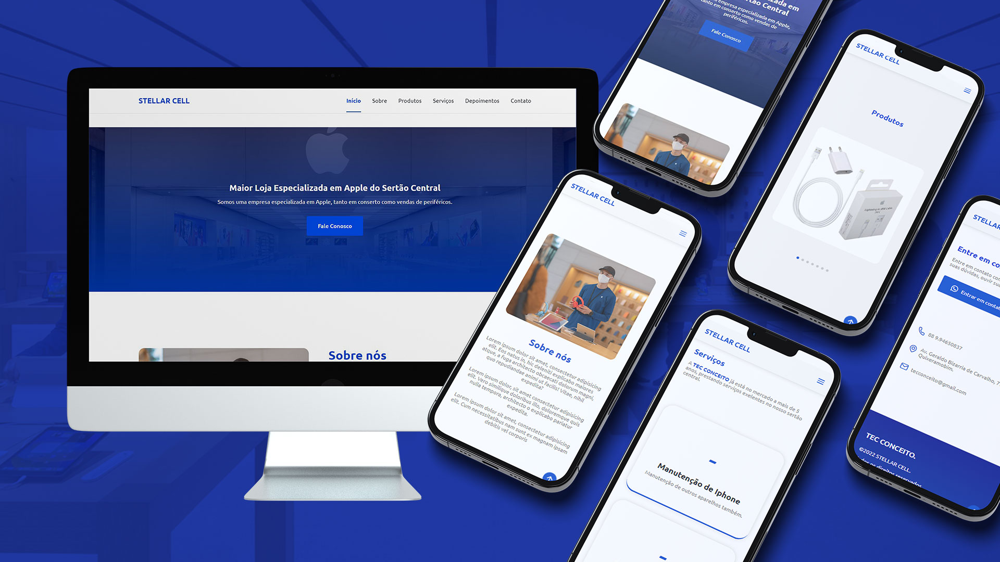

<h1 align="center"> Landing Page </h1>

  <a href="#-tecnologias">Tecnologias</a>&nbsp;&nbsp;&nbsp;|&nbsp;&nbsp;&nbsp;
  <a href="#-projeto">Projeto</a>&nbsp;&nbsp;&nbsp;|&nbsp;&nbsp;&nbsp;
  <a href="#-layout">Layout</a>&nbsp;&nbsp;&nbsp;|&nbsp;&nbsp;&nbsp;
  <a href="#memo-licença">Licença</a>

  

 

  

## 🚀 Tecnologias

Esse projeto foi desenvolvido com as seguintes tecnologias:

- HTML e CSS
- JavaScript
- Git e Github

## 💻 Projeto

Landing Page desenvolvida para empresa de refrigeração.

- [Acesse o projeto finalizado, online](https://ravycarvalhodeveloper.github.io/landing-page-store/)

## 🔖 Layout

Layout desenvolvido baseado em layout feito pela a empresa Rocketseat.

## :memo: Licença

Esse projeto está sob a licença MIT.

---

Developer: Ravy Carvalho
